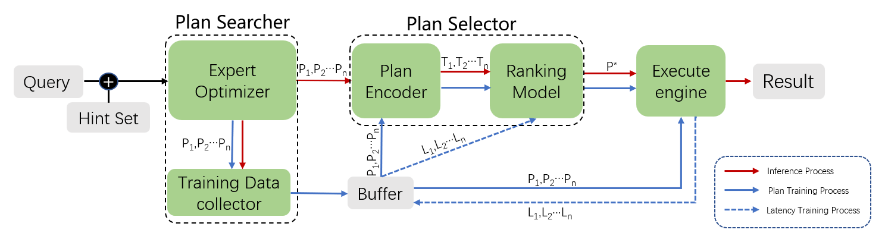

# Saro: A Simplified Attention-based Learning-to-Rank Query Optimizer

Saro是一个对物理执行计划和TCNN（树卷积神经网络）做注意力机制改进的基于排序学习的查询优化器系统，其结构继承于COOOL。



这个仓库是基于PostgreSQL的Saro简单演示版本，目前实现了使用psychopg2作为插件集成到PostgreSQL实现查询功能，未来我们打算将Saro集成到PostgresSQL的源代码中以实现更高的效率。

## 开始

1.安装PostgreSQL，Saro使用PostgreSQL 13.1

2.安装依赖包

```bash
pip install -r requirements.txt
```

3.创建数据库

## 推理流程示例

```python
# 填写参数，连接数据库
DBParam = {
    "dbname": "STATS",
    "user": "postgres",
    "password": "postgres",
    "port": 5432
}
# 填写查询文件路径
sql_path = r'.\datasets\STATS\q0.sql'
model_path = r'.\outputs\finetune.pt'

# 创建调用Saro推理器
saro_infer = Saro_infer(DBParam, sql_path, model_path)
index, execution_time, result = saro_infer.run_inference()

# 返回结果
print(index, execution_time, result)
```


### 实用小工具

`PGconnector.py`：在psychopg2的基础上实现的PostgreSQL连接器

其中`PostgresDB` 是一个用于连接和操作 PostgreSQL 数据库的类。它封装了对数据库的基本操作，提供以下功能：

- **连接与关闭**：建立和关闭与数据库的连接。
- **执行查询**：运行 SQL 查询并返回结果。
- **执行 SQL 文件**：读取并执行 SQL 文件中的查询。
- **获取执行计划**：返回查询的执行计划，以 JSON 格式展示。
- **提取表名**：从 SQL 查询中提取涉及的表名。
- **获取表基数**：查询指定表的行数。

2024.10.23

